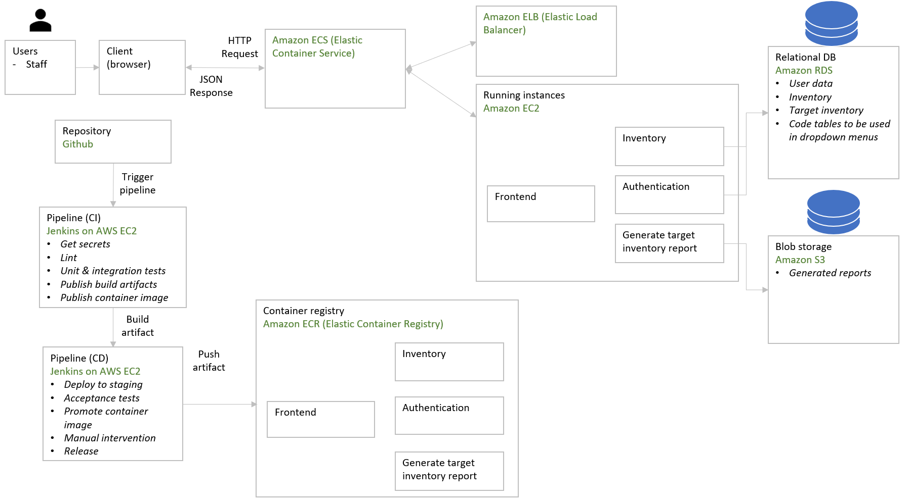

# Entities at a glance

## Inventory

| Field       | Description |
| ----------- | ----------- |
| inventoryId |            |
| itemName        |             |
| category    |             |
| unit        |             |
| receivedQuantity    |             |
| expiryDate  | date        |
| createdDate | dateTime    |
| remarks     | string      |

## Target inventory

| Field    | Description                               |
| -------- | ----------------------------------------- |
| target_id |                                 |
| category |                                           |
| unit     |                                           |
| target_quantity |                                   |
| target_month    | length 2 string |
| target_year | length 4 string                |


## User

| Field    | Description |
| -------- | ----------- |
| username |             |
| password |             |
| email    |             |
| role     |             |

## Report
| Field    | Description |
| -------- | ----------- |
| month |             |
| year |             |
| reportString    | Base64 string representing report csv |

# ERD for relational DB

Head to this link and paste the code in:
https://databasediagram.com/app

```
tbl_user
-
ID int PK
  username varchar(100) NOT NULL
  password varchar(50) NOT NULL
  email varchar(100) NOT NULL
  roleID int FK > tbl_code_role.role

tbl_inventory
-
ID int PK
name varchar(100)
categoryID int FK > tbl_code_category.ID
quantity int
unitID int FK > tbl_code_unit.ID
expiryDate date
createdDate dateTime

tbl_target_inventory
-
ID int PK
categoryID int FK > tbl_code_category.ID
quantity int
unitID int FK > tbl_code_unit.ID
month date

tbl_code_role
-
ID int PK
role varchar(20) NOT NULL
description varchar(100) NOT NULL

tbl_code_unit
-
ID int PK
unit varchar(20)
description varchar(100)

tbl_code_category
-
ID int PK
unit varchar(20)
description varchar(100)
```

# Architecture diagram


# Other references

- [API tech specs](architecture/api-tech-specs.md)
