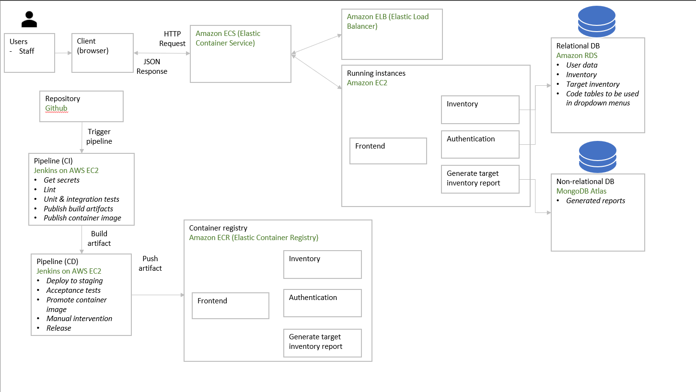

# local Multi-container Docker setup with docker-compose

# Prerequisites: Docker, Docker Compose, Java 11

1. Command prompt: git clone
2. Command prompt: set JAVA_HOME=<your Java 11 directory>.
3. Command prompt: cd into each of auth, inventory-management, report and run "/mvnw.cmd clean install -DskipTests"
4. In the main directory, edit docker-compose accordingly to which containers to run
5. Command prompt: docker-compose up --build

# Inventory management by Shannon123

1. **Pulling the Application Image from Docker Hub**:

   - Run the following command to pull the `inventory-management-app` image from Docker Hub:
     `docker pull shaowchin98/inventory-management-app:latest`

2. **Get the Docker Compose File**:

   - Obtain the `docker-compose.yml` file from git in 'shannon-inventory-management'

3. **Starting the Services**:

   - Open a terminal or command prompt and navigate to the directory containing the `docker-compose.yml`.
   - Run the following command to start both the application and the database:
     `docker-compose up`

4. **Accessing the Application**:

   - Once the services are up and running, you can access the Inventory Management App on your web browser by navigating to:
     http://localhost:8001/giftandgain/.....

5. **(Optional)Accessing the Database**:
   - The MySQL database is accessible on port `3308` of the machine.
   - connect using any MySQL client with the following credentials:
     - **Username**: giftandgain
     - **Password**: giftandgain123
     - **Host**: localhost
     - **Port**: 3308

=======

# Entities at a glance

## Inventory

| Field            | Description |
| ---------------- | ----------- |
| inventoryId      |             |
| itemName         |             |
| category         |             |
| unit             |             |
| receivedQuantity |             |
| expiryDate       | date        |
| createdDate      | dateTime    |
| remarks          | string      |

## Target inventory

| Field           | Description     |
| --------------- | --------------- |
| target_id       |                 |
| category        |                 |
| unit            |                 |
| target_quantity |                 |
| target_month    | length 2 string |
| target_year     | length 4 string |

## User

| Field    | Description |
| -------- | ----------- |
| username |             |
| password |             |
| email    |             |
| role     |             |

## Report

| Field        | Description                           |
| ------------ | ------------------------------------- |
| month        |                                       |
| year         |                                       |
| reportString | Base64 string representing report csv |

# Architecture diagram

# Other references

- [API tech specs](architecture/api-tech-specs.md)
